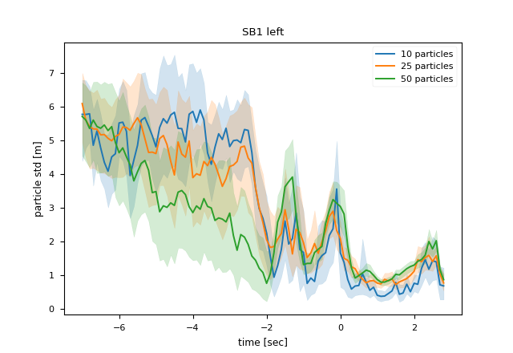
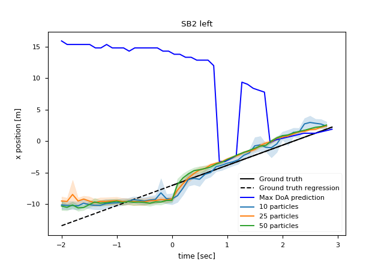

# Blind-spot detection through sound

This is the repository of the paper "Blind-spot detection through sound". The experimental data, code, and the result images are contained.

## Dataset

The dataset is from the reference study. It is the github repository of the paper "Hearing What You Cannot See: Acoustic Vehicle Detection Around Corners". The details are in the below link.  
https://github.com/tudelft-iv/occluded_vehicle_acoustic_detection

Dataset is in [**cls_features**](./cls_features) folder.  

- **out_multi.csv** file is the result of SRP-PHAT algorithm.  
- **ueye_stereo_vid.mp4** file is the obtained images by camera on the ego vehicle.  
- **extracted_features.csv** file is the result of SRP-PHAT algorithm of entire dataset that the one-second before appearing at line-of-sight.

## How to run the code

SRP-PHAT algorithm running first
```bash
sh featureExtract.sh
```

For classification test
```bash
sh classification_test.sh
```

For tracking test
```bash
sh tracking_test.sh
```

Get particle filter convergence variance image
```bash
python plotVarianceImg.py
```

- classification experiment results are in **log.txt** file  
- tracking experiment results are  


## Result images

---
---

### SA2 Environment
---
---
<center>
<h4>Left<h4>
</center>


|Data|Tracking result|Variance|
|:-:|:---------:|:---------:|
|1_01_0036|||
|1_01_0038|||
|1_01_0041|||
|1_01_0044|||

<center>
<h4>Right<h4>
</center>

|Data|Tracking result|Variance|
|:-:|:---------:|:---------:|
|3_01_0040|||
|3_01_0047|||
|3_01_0050|!||
|3_01_0051|||

---
---

### SB1 Environment
---
---
<center>
<h4>Left<h4>
</center>


|Data|Tracking result|Variance|
|:-:|:---------:|:---------:|
|1_02_0086|||
|1_02_0093|||
|1_02_0094|||

<center>
<h4>Right<h4>
</center>

|Data|Tracking result|Variance|
|:-:|:---------:|:---------:|
|3_02_0093|||
|3_02_0094|||
|3_02_0097|!||
|3_02_0099|||
|3_02_0108|||

---
---

### SB2 Environment

---
---
<center>
<h4>Left<h4>
</center>


|Data|Tracking result|Variance|
|:-:|:---------:|:---------:|
|1_03_0062|||
|1_03_0066|||
|1_03_0067|||
|1_03_0070|||
|1_03_0075|||
|1_03_0085|||

<center>
<h4>Right<h4>
</center>

|Data|Tracking result|Variance|
|:-:|:---------:|:---------:|
|3_03_0059|||
|3_03_0064|||
|3_03_0065|!||
|3_03_0082|||

---
---


## Authors

copyright  
Autonomous Robot Intelligence Lab, SNU  

Jae-Kyung Cho  
Seong-Woo Kim